# auxfirst skill — visual map

Read this when you need to see the whole procedure at once: when it fires, the
nine-step loop, what each step produces, and how the supporting frameworks
connect. The diagrams are Mermaid. Paste any fenced block into
[mermaid.live](https://mermaid.live) if the renderer in front of you truncates.

**The question the skill answers.** Given an action this agent can take, what
does the team owe before it is allowed to take it unsupervised?

**The rule everything hangs from.** An action is as hot as its hottest
dimension. No averaging.

---

## 1. Whole-system map

Trigger, pre-check, the nine-step loop, artefacts, and the two claims the skill
refuses to make.

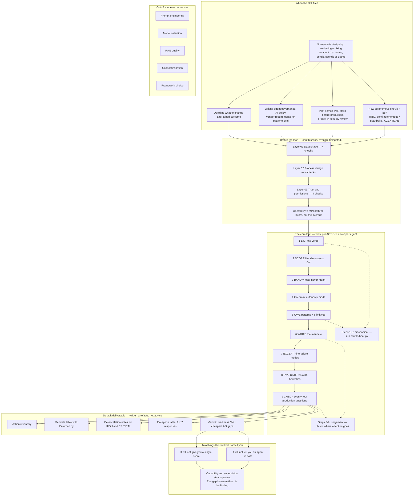

---

## 2. Trigger vs. near-miss

The description is the entire triggering mechanism. Easy negatives (RAG, model
choice, cost) are deliberate, because easy negatives make an eval score
meaningless.

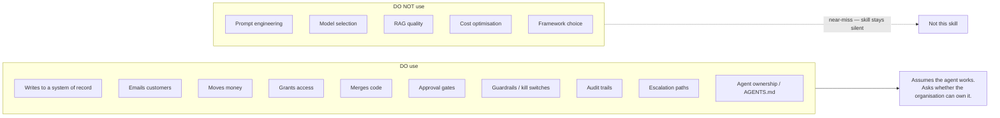

---

## 3. Workflow readiness — three layers, twelve checks

Run **before** designing an agent. Any layer where you cannot answer three of
four is where the pilot will stall. A low score is a list of cheaper fixes, not
a refusal.

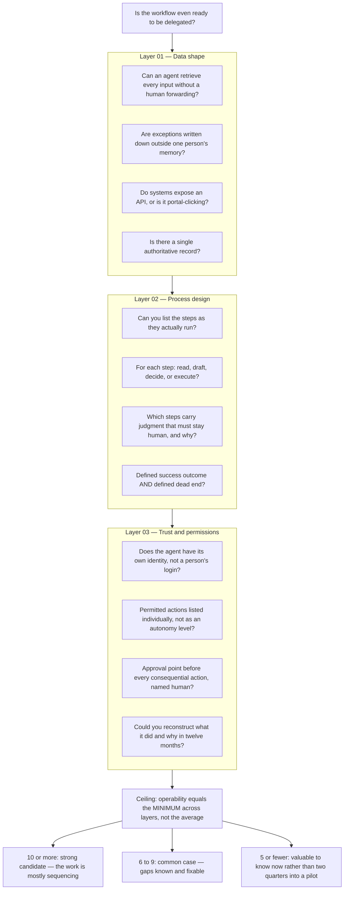

---

## 4. Core loop — nine steps, per action

An agent that can do nine things has nine answers. Averaging them is the
mistake this skill exists to prevent.

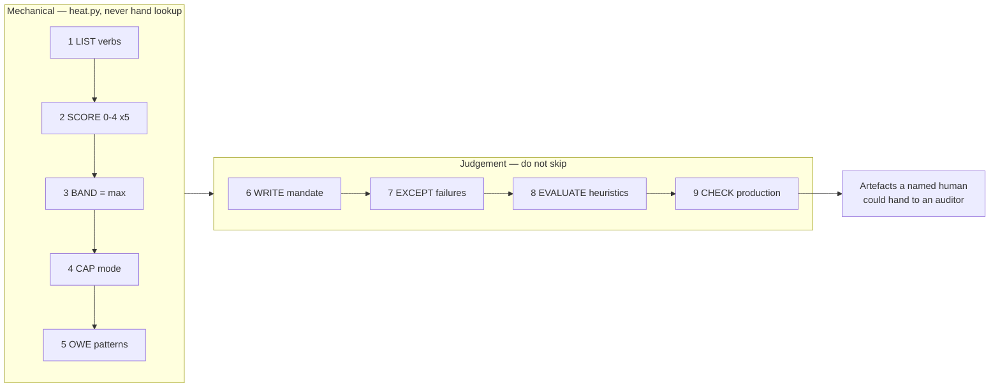

---

## 5. Scoring — five dimensions, anchors 0 and 4

Score the action **as the agent would actually perform it**, with wrong inputs,
on **granted** scope (the token is the truth; the prompt is a wish).

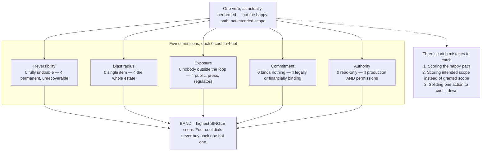

### Dimension anchors in full

```mermaid
flowchart LR
  subgraph REV["Reversibility"]
    R0["0 Fully undoable, no trace, no cost"]
    R1["1 Undoable with effort: credit note, revert"]
    R2["2 Partially undoable; some effects persist"]
    R3["3 Undoable only through a process someone else controls"]
    R4["4 Permanent and unrecoverable"]
    R0 --> R1 --> R2 --> R3 --> R4
  end

  subgraph BLAST["Blast radius"]
    B0["0 Single item, record, or message"]
    B1["1 A handful, bounded and enumerable"]
    B2["2 One team, account, or customer footprint"]
    B3["3 A whole function or segment"]
    B4["4 The entire estate"]
    B0 --> B1 --> B2 --> B3 --> B4
  end

  subgraph EXP["Exposure"]
    E0["0 Nobody outside the loop"]
    E1["1 Internal, beyond the operator"]
    E2["2 Named external party under NDA or contract"]
    E3["3 Customer or partner — it leaves the building"]
    E4["4 Public, press, regulators"]
    E0 --> E1 --> E2 --> E3 --> E4
  end

  subgraph COM["Commitment"]
    C0["0 Binds nothing"]
    C1["1 Informal expectation"]
    C2["2 Operational promise: date, fix, callback"]
    C3["3 Commercial position in the company's name"]
    C4["4 Legally or financially binding"]
    C0 --> C1 --> C2 --> C3 --> C4
  end

  subgraph AUTH["Authority — granted token, not prompt"]
    A0["0 Read-only, scoped"]
    A1["1 Drafts, documents, or one scoped field"]
    A2["2 Writes broadly to a system of record"]
    A3["3 Broad write to production data and infra"]
    A4["4 Can change who can do what"]
    A0 --> A1 --> A2 --> A3 --> A4
  end
```

---

## 6. Band → control posture → autonomy ceiling

The band is a **ceiling, not a target**. Design work is moving an action *down*
a band with de-escalators.

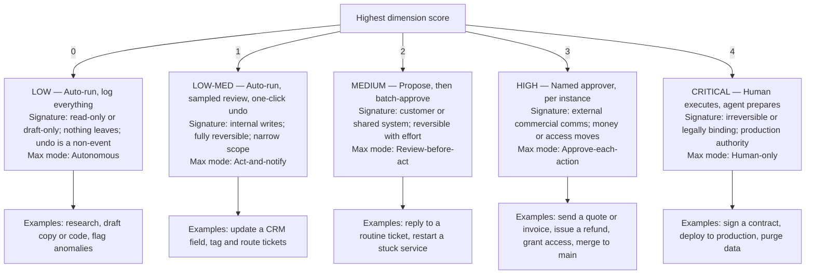

---

## 7. Escalators and de-escalators

Classification without a de-escalator is not design.

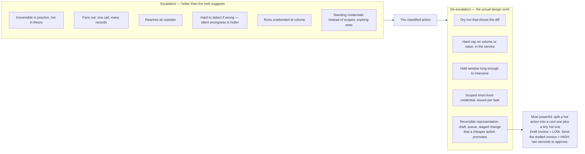

---

## 8. What the mode obliges you to build

Heat sets the ceiling. Patterns buy the approach. Each row is **cumulative**.
A product moving up the spectrum needs new patterns, not new model capability.

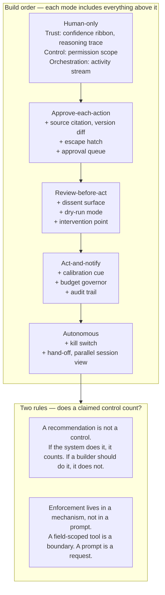

---

## 9. Six supervision primitives

Independent of mode. They decide whether the accountable human can see, approve,
and undo what happened.

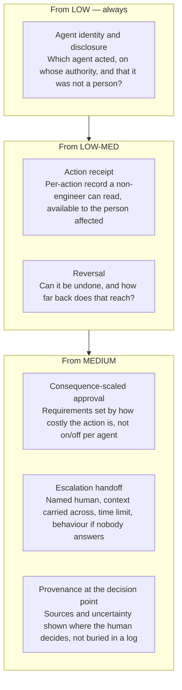

---

## 10. Mandate — four authority values, nothing else

Refuse *semi-autonomous*. Define authority for specific actions. The
**Enforced by** column is not optional: an empty cell means the row is
aspirational.

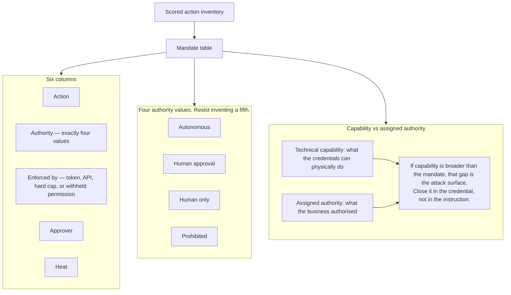

Worked mandate shape (from SKILL.md):

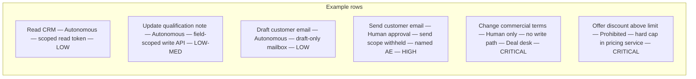

---

## 11. Exceptions — nine situations, seven responses

Most agent descriptions explain the happy path. Operations depend on the other
nine.

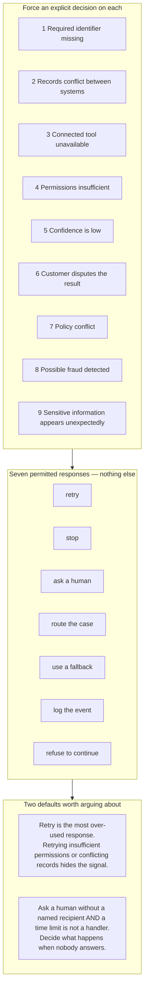

---

## 12. Ten AUX heuristics

Optimise for **quality of relationship**, not clarity of interface. If H05 is
ambiguous, the surface is not done. In production, failures cluster in H03,
H05 and H06.

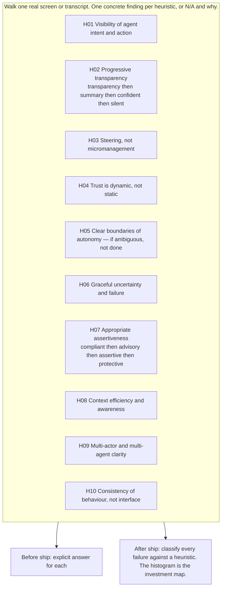

---

## 13. Six AUX patterns — what you actually ship

Principles are beliefs. Heuristics evaluate. Patterns are what you ship. Each
has a shape, a contract, a failure mode, and a trigger. Skip the contract and
the pattern degrades into decoration.

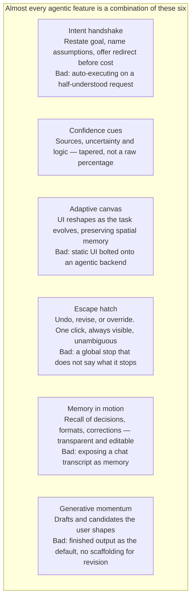

---

## 14. Production check — twenty-four questions, one real agent

Anything the team cannot answer in under a minute **is** the finding. Never
score the estate in aggregate.

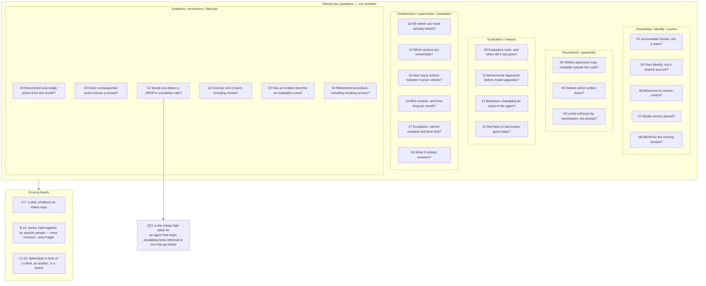

---

## 15. Estate artefacts — first five, then twenty-two

Do not build all twenty-two for agent one. The first five make an agent
defensible. The rest become necessary as the estate grows.

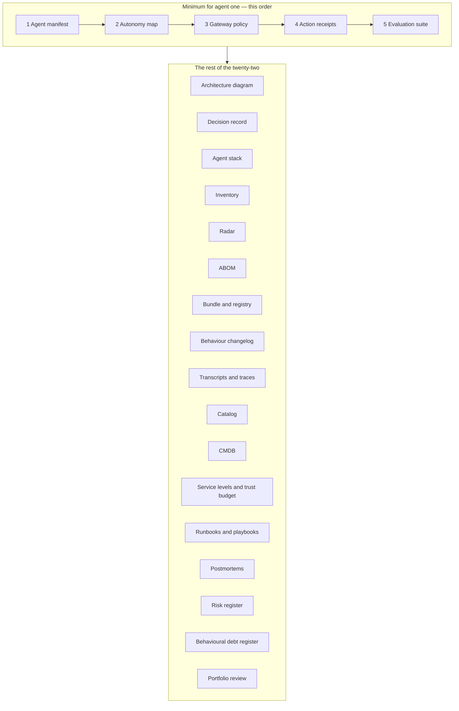

---

## 16. Owner's manual — handover and governance

Use when the work is documentation rather than design, or when "who owns this?"
answers with a team name.

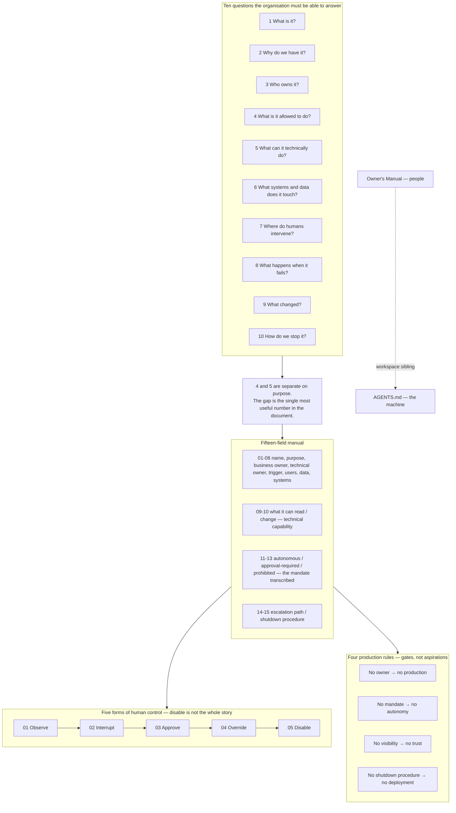

---

## 17. Quality bar and named failure modes

A good result is one the accountable human could hand to an auditor: every
action named, every authority one of the four, every restriction traced to a
mechanism, every escalation pointed at a person with a deadline.

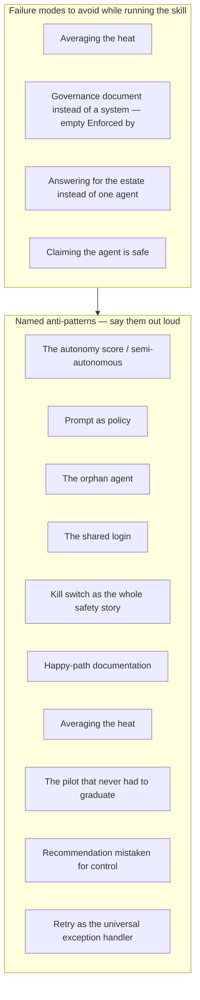

---

## 18. Worked example — send a routine invoice

Three dials are cool. The action is still HIGH. A team scoring by average would
have called this low-medium and shipped it on auto-run.

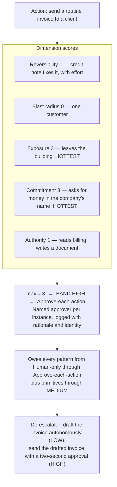

---

## 19. Files the skill loads

```mermaid
flowchart TB
  SK["SKILL.md — the loop, the tables, the output contract"]

  subgraph REF["references/ — load on read-condition"]
    HL["heat-ladder.md — anchors, escalators, primitives"]
    HP["heuristics-and-patterns.md — 10 heuristics, 6 patterns"]
    PC["production-check.md — 24 questions, 22 artefacts"]
    OM["owners-manual.md — 15 fields, 5 controls, AGENTS.md"]
    WR["workflow-readiness.md — 3x4 operability test"]
    AP["anti-patterns.md — named failure modes and vocabulary"]
    SM["skill-map.md — this visual map"]
  end

  subgraph ASSETS["assets/ — blank artefacts to fill with the user"]
    MT["mandate-template.md"]
    OT["owners-manual-template.md"]
    AT["autonomy-map-template.md"]
  end

  subgraph CODE["scripts/"]
    HT["heat.py — deterministic max, never mean<br/>--score 1,0,3,3,1 --action send invoice"]
  end

  SK --> REF
  SK --> ASSETS
  SK --> CODE
  S1["Steps 1-5"] --> HT
  S2["Step 6"] --> MT
  S3["Handover"] --> OT
  S4["Plain-language mandate"] --> AT
```

---

## 20. Vocabulary used throughout

```mermaid
mindmap
  root((auxfirst))
    Agent
      memory
      initiative
      judgment
    AUX
      Agentic User Experience
      relationship, not discrete task
    AX
      Agent Experience
      API layer underneath
    Heat
      consequence of an action
      five dimensions
    Band
      heat class
      sets control posture
    Mandate
      assigned authority per action
      distinct from capability
    Action receipt
      what changed, on whose authority
      readable by a non-engineer
    Escalation handoff
      named human
      time limit
      behaviour if nobody answers
    Ownership debt
      works vs can be operated, handed over, changed, retired
    Agent operability
      property of the workflow
      not of the model or the enterprise
```
